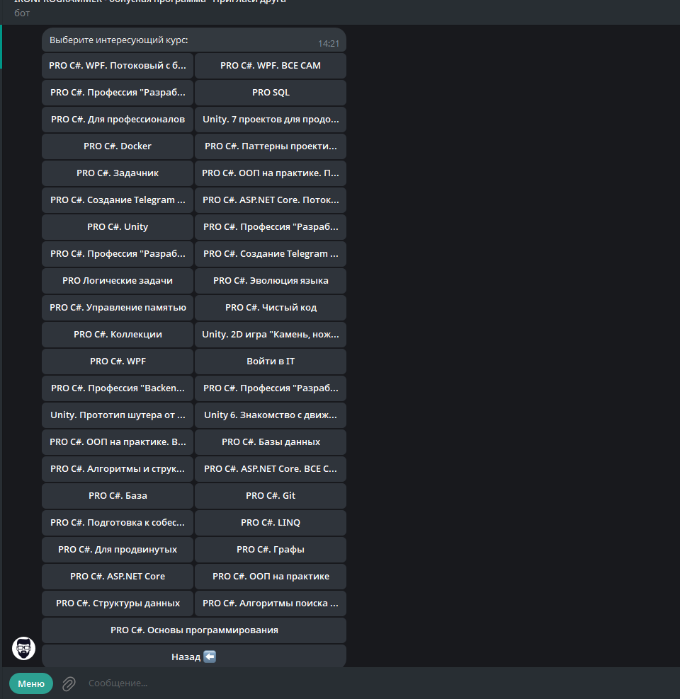
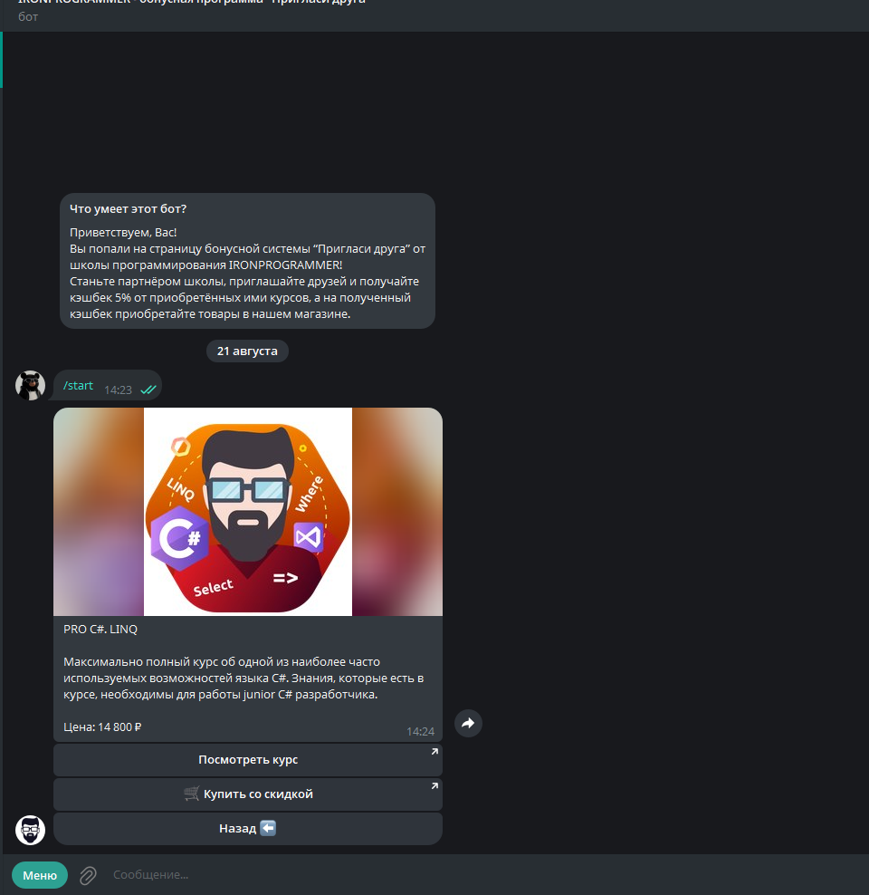
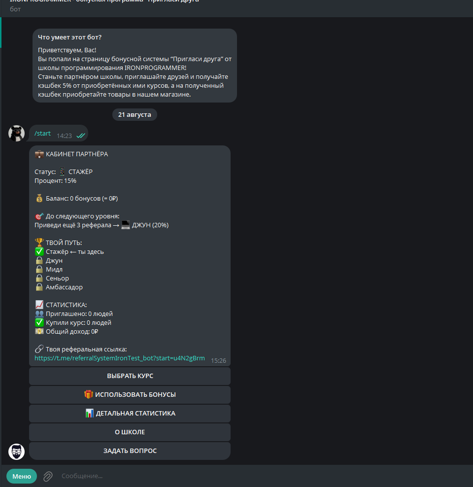

# telegram-referral-bot

[](https://github.com/Vanchestery/telegram-referral-bot/actions/workflows/ci.yml)


[](LICENSE)

Telegram bot for a course-school partner program: Stepik catalog, referral links, cashback bonuses, and a partner cabinet.

Portfolio project: three-tier ASP.NET Core, an `IPage` navigation stack, Stepik API with Polly retry, and REST payment webhooks.

## Screenshots

| Catalog | Course card | Partner cabinet |
|---------|-------------|-----------------|
|  |  |  |

## Stack

.NET 10 (LTS) · ASP.NET Core Web API · EF Core · PostgreSQL · Telegram.Bot 22 · Polly · Serilog · xUnit / Moq / FluentAssertions

Local webhooks use **Visual Studio Dev Tunnels** (not ngrok). The host reads `VS_TUNNEL_URL` on F5 and falls back to `REF_BOT_WEBHOOK_URL`.

## Features

- **Stepik catalog** — public teacher courses with cover, summary, and price (15-minute cache).
- **Discount checkout** — pay link uses the partner promo hex when one exists (`/a/{id}/pay?promo=…`); otherwise a plain pay URL.
- **Referrals** — `/start {key}` assigns a referrer once; partner cabinet, levels, and bonus balance.
- **REST** — payment/refund webhooks, promo lookup, partner list; `X-Partners-Key` when `PARTNERS_API_KEY` is set.
- **Telegram webhook** — `POST /webhook/update` deserializes snake_case `Update` via `JsonBotAPI`.
- **Daily stats** — background job messages partners at 09:00 UTC.

## Architecture

The web host never talks to the database directly — only through Core services.

| Project | Role |
|---------|------|
| `ReferralBot.Core` | Domain models, interfaces, services, AutoMapper |
| `ReferralBot.Db` | EF Core entities, storage, PostgreSQL migrations |
| `telegram-referral-bot` | Webhook, REST, page engine, Stepik client |
| `ReferralBot.Tests` | Unit tests (16) |

Navigation is an `IPage` stack persisted per Telegram user. Back pops the stack.

## Run locally

**Needs:** .NET 10 SDK, Docker Desktop, Visual Studio (for Dev Tunnels), `dotnet-ef`.

Startup project: `telegram-referral-bot`.

1. **Postgres** (host port **5434**):

   ```bash
   docker compose up -d db
   ```

2. **Secrets** (do not commit; project `telegram-referral-bot`):

   ```bash
   dotnet user-secrets set "REF_BOT_KEY" "<BotFather token>" --project telegram-referral-bot
   dotnet user-secrets set "BOT_USERNAME" "<username without @>" --project telegram-referral-bot
   dotnet user-secrets set "ADMIN_TELEGRAM_ID" "<your Telegram id>" --project telegram-referral-bot
   dotnet user-secrets set "STEPIK_TEACHER_ID" "<teacher id>" --project telegram-referral-bot
   ```

   Optional: `STEPIK_CLIENT_ID` / `STEPIK_CLIENT_SECRET`, `PARTNERS_API_KEY`.  
   `POSTGRES_REFERRALBOT_DB` is already in `appsettings.Development.json`.  
   `REF_BOT_WEBHOOK_URL` is not required when F5 runs with a **public** Dev Tunnel.

3. **Migrations:**

   ```bash
   dotnet ef database update --project ReferralBot.Db --startup-project telegram-referral-bot
   ```

4. **Dev Tunnel** in Visual Studio: debug dropdown → **Dev Tunnels** → **Public** (persistent). Then F5 on the `https` profile (`https://localhost:7125`).

   Logs should include `Using Dev Tunnel URL for webhook` and `Webhook configured successfully`.

Full environment list: [`.env.example`](.env.example).

## Tests

```bash
dotnet test
```

Covers course catalog filtering/cache, promo hex lookup, Telegram snake_case `Update` JSON, bonus payment idempotency, and single-referrer assignment.

## HTTP

| Path | Notes |
|------|--------|
| `POST /webhook/update` | Telegram updates (no partners key) |
| `GET /health` | Liveness |
| `GET /api/partners` | Requires `X-Partners-Key` when the secret is set |
| `POST /api/bonus/payment` | Payment webhook |
| `/scalar` | OpenAPI UI in Development |

## Docker

```bash
cp .env.example .env   # fill in secrets
docker compose up --build
```

Bot listens on `http://localhost:8080`. Apply migrations against the compose Postgres instance before the first run.

## Implementation notes

- Incoming Telegram JSON is snake_case; the webhook uses `JsonBotAPI.Options` so `first_name` maps to `FirstName`.
- Stepik list/detail endpoints are public; OAuth is optional. Course covers are sent as photo URLs so a hung CDN does not drop the card.
- Stepik HTTP calls use Polly retries on 5xx.

## License

[MIT](LICENSE) © 2026 Ivan

**Contact:** [github.com/Vanchestery](https://github.com/Vanchestery)
